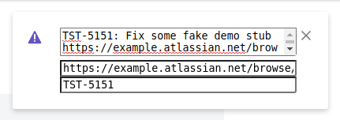

# working-bookmarklets

[![code style: prettier][codestyle-image]][codestyle-url]

> My working bookmarklets

## How to use

Add browser bookmark with URL filed with content of ./build/*.js file.

## Bookmarklets

### [at-new-task](./build/at-new-task.js)
actiTIME add new task by paste processed text

### [at-stat](./build/at-stat.js)
Improve actiTIME Enter Time-Track page design

### [design](./build/design.js)
Toggle browser design mode

### [gh-toggle](./build/gh-toggle.js)
```
user.github.io/project  => github.com/user/project
github.com/user/project => user.github.io/project
```

### [go-to-i](./build/go-to-i.js)
```
example.com/blog/posts/1 => example.com
```

### [go-to-i1](./build/go-to-i1.js)
```
example.com => example.com/new-import?importId=1
```

### [go-to-parent-directory](./build/go-to-parent-directory.js)
```
example.com/blog/posts/1 => example.com/blog/posts
example.com/blog/posts   => example.com/blog
example.com/blog         => example.com
```

### [go-to-parent-subdomain](./build/go-to-parent-subdomain.js)
```
v1.blog.example.com => blog.example.com
blog.example.com    => example.com
```

### [jira-task-data](./build/jira-task-data.js)
Open JIRA task data tooltip  



### [dev-css-inspector](./build/dev-css-inspector.js)
Highlights QA data-attributes

## License

MIT © [Vladimir Rodkin](https://github.com/VovanR)

[codestyle-url]: https://github.com/prettier/prettier
[codestyle-image]: https://img.shields.io/badge/code_style-prettier-ff69b4.svg?style=flat-square
